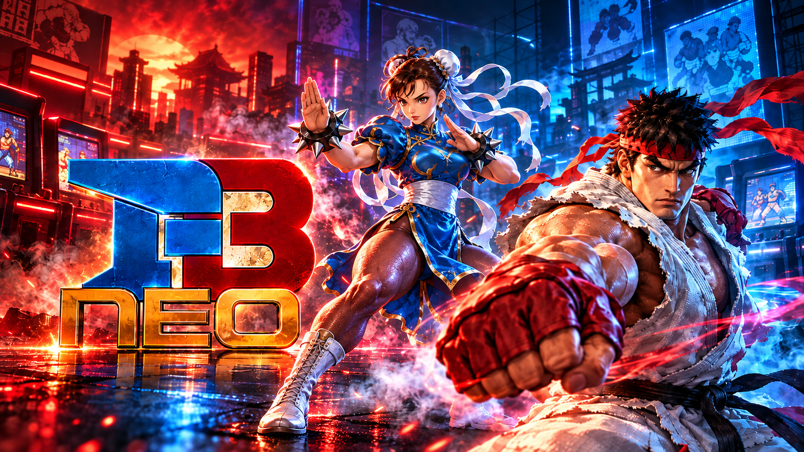

# FBNeo PS5



[FinalBurn Neo](https://github.com/finalburnneo/FBNeo) (FBNeo) 1.0.0.3, the arcade emulator, running on a jailbroken
PS5 as a **native home-screen app** with its own icon and background. It plays the arcade games FBNeo emulates --
8,379 drivers: Capcom CPS-1, CPS-2 and CPS-3, **Neo Geo MVS/AES**, IGS PGM and PGM2, Cave, Toaplan, Psikyo, Sega
System 1/16/18/24/32, X and Y boards, Konami, Taito, Irem, Data East, Midway, Kaneko, Seta, the classics of the 70s
and 80s, and many more -- from their ROM sets (`.zip`), named as FBNeo names them.

**Inside the emulator, to access the main menu press L3 + R3.**

This port is for the **arcade games only**. FBNeo's home-console drivers (Mega Drive, PC Engine, Master System,
NES, SNES, MSX, ColecoVision, SG-1000, ZX Spectrum, Channel F, GBA, Neo Geo Pocket) and the Neo Geo CD are not built
in: Genesis Plus GX PS5, Snes9x PS5 and Mesen2 PS5 cover the consoles.

The PS5 layer follows the layout of PS5SX2 (the PCSX2 port) and of Snes9x PS5, Mesen2 PS5 and Genesis Plus GX PS5,
the ports it comes from:

- `ps5/coreorbis` holds `main-boot.cpp`, the `orbis-shims/` and `include-orbis/`;
- `ps5/frontend` holds the user interface, the 3D game shelf and the glue to FBNeo's core (`fe_burn.cpp`);
- `ps5/core.mk` and `ps5/core/` build FBNeo's core from its own build lists;
- `ps5/proto/native` builds and signs `eboot.bin`;
- `ps5/installer` is the installer and helper payload.

Everything outside `ps5/` is FBNeo's source, **unchanged**, apart from this README (the original one is
[README-FBNeo.md](README-FBNeo.md)). The core -- `src/burn` (the drivers), `src/cpu` and the libraries it uses -- is
compiled as it is, with the object lists of FBNeo's `makefile.burn_rules` and the generated sources its makefiles
make (the driver list, Musashi's 68000 core, the CPS, Neo Geo, Cave, Psikyo, Toaplan and PGM render functions).
`ps5/frontend/fe_burn.cpp` is the frontend FBNeo's core needs, written again for this port the way FBNeo's own
frontends (`src/burner`) and its libretro port host the core: ROM loading from the sets' zips, inputs, DIP
switches, states, NVRAM, the picture turned the right way up and the sound.

> **Status (1.0):** builds with the ps5-payload-dev SDK into a signed native app, and passes 190 host tests, which
> run the same code (FBNeo's core included) on Linux with the PS5 calls simulated: two arcade boards running a tiny
> test program each (a vertical and a horizontal game) are played through the whole chain -- the shelf, the pad,
> the core, the video and sound output -- and 26 more boards start, run, save and load a state under
> AddressSanitizer. Not yet confirmed on a console. If something fails, the logs in `/data/fbneo/logs/` say where.

## How it works

The PS5 gives the controller only to the app in front, so FBNeo runs as a native app opened from its icon, and the
payload you send is its installer:

| Piece | What it is | In PS5SX2 |
|---|---|---|
| `eboot.bin` in `/data/homebrew/PPSA99012/` | **FBNeo itself**, a native app opened from its icon | PCSX2 (PPSA99203) |
| `sce_module/libc.prx` | the C runtime module every native app carries | the same file, byte for byte |
| `FBNeoPS5.elf` (payload) | the **installer**: installs or updates the app, then stays running as the **helper** | PS5SX2Installer.elf + PS5SX2Helper.elf |

FBNeo is big (`eboot.bin` is 43 MB), so the installer carries it and the background compressed and unpacks them
on the console: `FBNeoPS5.elf` is about 22 MB.

When it opens, the app asks the helper to let it out of its sandbox; without that an app sees neither `/data`
nor USB drives. The request is the one PS5SX2 makes:

- **Who is asked, in order:** the FBNeo helper (127.0.0.1:9078), then etaHEN (9028) and the daemon on port 9069.
- **If nobody answers:** the app carries a copy of the helper (`FBNeoPS5-helper.elf`), sends it to the ELF loader
  (127.0.0.1:9021) and asks again. So the icon keeps working after a reboot, as long as the ELF loader runs.
- **What the helper allows:** only title PPSA99012. It gives the process the system's root folder and uid 0, as
  elfldr does for payloads. No other app is touched.

FBNeo PS5 only uses `/data/fbneo/`, `/data/homebrew/PPSA99012/` and its own `/user/appmeta/PPSA99012/`. It sits
next to Snes9x PS5 (PPSA99009, helper port 9075), Mesen2 PS5 (PPSA99010, port 9076), Genesis Plus GX PS5
(PPSA99011, port 9077) and PS5SX2 (PPSA99203) without touching them.

## Versions

Every release carries its version in the file name: `FBNeoPS5-v1.0.elf` (`make dist`). When updating, replace the
old ELF with the new one in your autoload or Payload Manager. In this README, "`FBNeoPS5.elf`" always means the
current release's ELF.

**1.0:** the first release.

## Language

Every screen and notification of FBNeo PS5 is in English.

## Requirements

- A jailbroken PS5 with **kstuff** (or kstuff-lite) and an **ELF loader** on port 9021: elfldr, etaHEN, or the
  one PS5 Payload Manager uses.
- **ShadowMountPlus**, so the icon appears on the home screen (the same one PS5SX2 uses).
- Your own ROM sets. None are included.

## Install and play

1. **Send `FBNeoPS5.elf`** with PS5 Payload Manager, or from a PC on the same network:
   ```sh
   nc -q0 PS5_IP 9021 < FBNeoPS5-v1.0.elf
   ```
   It installs the app in `/data/homebrew/PPSA99012/` (`eboot.bin`, `sce_module/libc.prx`, `param.json`, the
   icon and the backgrounds), shows **"FBNeo PS5 1.0 installed. Open it from the FBNeo PS5 icon on the home
   screen."** and stays running as the helper.
2. **Open the FBNeo PS5 icon.** The game shelf appears and the controller works.
3. **Copy your ROM sets** to `/data/fbneo/roms/` (over FTP, for example), or to `fbneo/roms/` on a USB drive.
   Subfolders are fine. The app makes the folders on its first start.

Tip: put `FBNeoPS5.elf` in your autoload, as PS5SX2 recommends for its payloads.

**Updating:** send the new `FBNeoPS5.elf` once. It compares every app file with the copy it carries and rewrites
only what changed; each file is written to a temporary file and then renamed, `eboot.bin` last. A deleted or
damaged file is put back the same way. A second copy sent while the helper is already running only installs and
exits.

**If "FBNeo PS5 has no access to /data" appears:** no helper answered and the ELF loader wasn't running. Send
`FBNeoPS5.elf` and open the icon again.

## ROM sets

FBNeo PS5 plays the same ROM sets as FBNeo 1.0.0.3 (and its libretro core of the same version), with the same
names. As in every FBNeo build:

- **One zip per set, named as FBNeo names it:** `sf2ce.zip`, `mslug.zip`, `pacman.zip`. The name is how the game
  is recognised; a renamed zip is not.
- **Clones need their parent:** `sf2ce.zip` (a clone) loads what it shares with `sf2.zip` from there, so put the
  parent next to it (anywhere in the ROM folders). A merged set (clones inside the parent's zip) works for the
  parent; the clones need their own zip.
- **BIOS sets:** the games of a board with a BIOS need the BIOS set too, anywhere in the ROM folders:

  | Games | BIOS set |
  |---|---|
  | Neo Geo MVS / AES | `neogeo.zip` |
  | IGS PGM | `pgm.zip` |
  | other boards with a BIOS | the set FBNeo names for them (the log says which, see below) |

  The BIOS sets are not games: they are not listed on the shelf.
- **The set must match FBNeo 1.0.0.3:** ROMs are found by their CRC, then by their name. A set made for another
  emulator, or for a much older or newer FBNeo, can miss ROMs or have others.
- **Samples:** the few games that play recorded sounds (Donkey Kong's walk, for example) look for their sample set
  (`dkong.zip`) in `/data/fbneo/samples/`. Without it they play without those sounds.
- **High scores:** with FBNeo's `hiscore.dat` in `/data/fbneo/hiscore/` (from
  [libretro/FBNeo's metadata folder](https://github.com/libretro/FBNeo/blob/master/metadata/hiscore.dat)), the
  games it knows keep their high score tables (`<set>.hi`, same folder). Settings, "Save high scores", turns it
  off.

**Checked before they are listed:** at each start the shelf checks every set it finds the way FBNeo loads it,
and lists only the complete ones. The result is kept in `/data/fbneo/config/romcheck.txt` and a set is checked
again only when one of its zips changes, so later starts are quick. A set with ROMs missing is hidden unless
Settings, **Show incomplete sets**, is on; starting it then names the missing ROMs on the screen. `boot.log` lists
every set found (`[games] ... -> "<name>"`) and the ROMs a set is missing (`[games] <set>: N ROM(s) missing, first
<rom>`).

| Folder | Contents |
|---|---|
| `/data/fbneo/roms` | your ROM sets and BIOS sets (`.zip`), sub-folders included; on a USB drive, `fbneo/roms` |
| `/data/fbneo/saves` | NVRAM (`<set>.nvram`, written within 5 seconds of a change and when the game closes) and EEPROMs (`<set>.nv`) |
| `/data/fbneo/states` | save states, `<set>.state1` to `.state10` |
| `/data/fbneo/config` | the DIP switches you changed, per game (`<set>.dip`), and `romcheck.txt` |
| `/data/fbneo/samples` | sample sets |
| `/data/fbneo/hiscore` | `hiscore.dat` and the high scores (`<set>.hi`) |
| `/data/fbneo/blend` | FBNeo's blend tables (`<set>.bld`, optional) |
| `/data/fbneo/covers` | covers: downloaded ones in `covers/FBNeo/`, your own as `<set>.png`; `wanted.txt` |
| `/data/fbneo/logs` | `boot.log` (the app), `installer.log` (installer/helper), `helper.log` (the helper the app starts), and the previous session's `.prev.log` files |
| `/data/fbneo/fbneo-ps5.ini` | the menu settings |

### The home-screen app

```
/data/homebrew/PPSA99012/
  eboot.bin              FBNeo (a native app, signed as PS5SX2's is), with the helper inside
  sce_module/libc.prx    the native app's C runtime (the same as PS5SX2's and ps5-native-app-boilerplate's)
  sce_sys/param.json     title "FBNeo PS5", ID PPSA99012
  sce_sys/icon0.png      the icon (512x512; ps5/app/sce_sys/icon0.png in the source)
  sce_sys/pic0.dds       the home-screen background while the icon is selected (3840x2160, BC7)
  sce_sys/pic1.dds       the launch background (the same image)
```

The icon and the background are the project's art. The icon, `ps5/app/sce_sys/icon-source.png` (512x512), is an
FBNeo arcade cabinet in an arcade hall; `icon0.png` is the same image. The background -- the large image behind the
icon when FBNeo PS5 is selected on the home screen, and the launch screen -- is the project's key art,
`ps5/app/sce_sys/background-source.png` (3840x2160), encoded to `pic0.dds`/`pic1.dds` as BC7 by
`ps5/tools/make_art.py` (bc7enc_rdo, as ps5-native-app-boilerplate's `tools/prepare-assets.sh --background` does).
To change them, replace `icon0.png` (512x512 PNG) or `background-source.png` (16:9), run
`python3 tools/make_art.py app/sce_sys frontend/assets/fonts/Roboto-Regular.ttf <bc7enc>` for the backgrounds, and
rebuild. For another title ID: `make ps5 TITLE_ID=XXXX00000`.

**Home-screen art:** ShadowMountPlus copies the art in `sce_sys` to `/user/appmeta/PPSA99012/` only when it first
registers the title. The installer keeps that folder current on every update, but if the title was registered
before the art changed, register it again once: select **FBNeo PS5** on the home screen, press **OPTIONS**, choose
**Delete** (your games, saves and covers in `/data/fbneo/` stay), then send `FBNeoPS5.elf` again.

## The game shelf and covers

The start screen is a 3D shelf of game covers, like PS5SX2's and Snes9x PS5's, with the author's line under the
wordmark: **github.com/MisterTemaki**.

- **All your games at once:** every complete set in the ROM folders, sorted by title (a parent before its clones).
  Each game's line says its board, maker, year, the version (`World 920513`) and the set's name.
- **By maker:** **Up / Down** switch between "All games" and the makers and boards that have games: Capcom (CPS-1,
  CPS-2, CPS-3 and the rest), Neo Geo, Sega, Konami, Taito, "Toaplan, Cave, Psikyo", Data East, Irem, Midway, IGS,
  Classics (the 70s and 80s: Pac-Man, Galaxian and their kind) and Other. The shelf remembers the last one.
- **Clones:** the other versions of a game (other regions, revisions, bootlegs) are listed after it; Settings,
  **Show clones**, hides them.
- **Automatic covers, the PS5SX2 way:** the art comes from libretro-thumbnails' **FBNeo - Arcade Games** collection
  over HTTPS, with the console's own `libSceHttp2`/`libSceSsl`, in a **prefetch** step as the app opens, before
  it asks for `/data` (30 s budget), exactly as PS5SX2 does. For each game, in order: its flyer (`Named_Boxarts`),
  its parent's flyer (most clones have none of their own), then a picture of the game (`Named_Snaps`), its own or
  its parent's.
  - Every start writes the missing covers to `/data/fbneo/covers/wanted.txt`; the helper hands that list to the
    app at the next start, and the prefetch fetches them.
  - **New games:** when the app finds covers it hasn't tried yet, it shows "Downloading covers..." and
    **restarts itself** (as PS5SX2 re-executes its own eboot); the covers arrive on that start.
  - Covers are kept in `covers/FBNeo/<the game's full name>.png` and never downloaded twice. A cover the server
    doesn't have is marked (`.missing`) and only looked for again after 30 days; **Square** forces a new try.
  - Without a network nothing is tried and the shelf works the same.
- **Your own covers:** a `.png` or `.jpg` named after the set, in `/data/fbneo/covers/FBNeo/` or `covers/`
  (`covers/sf2ce.png`), or next to the zip, takes priority over downloads.
- **No cover:** the game gets a card with its title and board.
- **Turning downloads off:** Settings, "Download covers".

### Downloading all the covers yourself

To fill the shelf without the console downloading anything, download the whole collection on a PC:

| | Link |
|---|---|
| All at once (zip) | [FBNeo_-_Arcade_Games master.zip](https://github.com/libretro-thumbnails/FBNeo_-_Arcade_Games/archive/refs/heads/master.zip) |
| Browse the flyers | [Named_Boxarts](https://github.com/libretro-thumbnails/FBNeo_-_Arcade_Games/tree/master/Named_Boxarts) |
| Browse the screenshots | [Named_Snaps](https://github.com/libretro-thumbnails/FBNeo_-_Arcade_Games/tree/master/Named_Snaps) |

1. Unpack the zip on the PC.
2. Copy the `.png` files of **`Named_Boxarts`** (not the folder itself) to `/data/fbneo/covers/FBNeo/`. For the
   games with no flyer, the `.png` of `Named_Snaps` can go there too (only those: a snap with a flyer's name would
   replace it).
3. Open the app: games pick their cover up at once, and nothing is downloaded for them.

Notes:

- The files are named after the game's full name in FBNeo (`Street Fighter II_ Champion Edition (World
  920513).png`), with the characters `` & * / : ` < > ? \ | " `` replaced by `_` as in the repository. `boot.log`
  lists each game's name (`[games] ... -> "<name>"`).
- A few `.png` files in the repository are git links: a small text file holding the name of another picture.
  The app follows them; in the zip they come out as text, so copy the picture they name under that file's name.
- One cover: `https://raw.githubusercontent.com/libretro-thumbnails/FBNeo_-_Arcade_Games/master/Named_Boxarts/<name>.png`
  (spaces as `%20`).

The shelf is drawn by the CPU in real 3D perspective (each cover a quad turned about the vertical axis, drawn
column by column with bilinear filtering, mipmaps and anti-aliased edges, split across several cores).

## Controls

**Inside the emulator, to access the main menu press L3 + R3.**

**On the shelf**

| Button | Does |
|---|---|
| Left / Right (D-pad or stick) | change game (hold to speed up) |
| Up / Down | change tab (All games, Capcom, Neo Geo, ...) |
| L1 / R1 | skip 10 games |
| Cross | play |
| Triangle | settings |
| Square | download this game's cover again (the cover it has stays until the new one has arrived) |
| OPTIONS | quit FBNeo PS5 (asks first) |

**In a game:** the joystick is the D-pad or the left stick; **touchpad click = Coin**, **OPTIONS = Start**. The
buttons follow the **button layout** (Settings, CONTROLS):

| PS5 | Classic layout (games with up to 5 buttons) | Fighting layout (6-button games: Street Fighter...) |
|---|---|---|
| Cross | Button 1 (Neo Geo A) | Button 4 (light kick) |
| Circle | Button 2 (Neo Geo B) | Button 5 (medium kick) |
| Square | Button 3 (Neo Geo C) | Button 1 (light punch) |
| Triangle | Button 4 (Neo Geo D) | Button 2 (medium punch) |
| L1 | Button 5 | Button 6 (heavy kick) |
| R1 | Button 6 | Button 3 (heavy punch) |
| touchpad click | Coin | Coin |
| OPTIONS | Start | Start |

The **Auto** layout (the default) uses the fighting layout for games with six buttons and the classic one for the
rest, as FBNeo's libretro core does with a pad. Games with analog controls (wheels, dials, trackballs, guns) read
the left stick (and the right stick for a second axis or pedal).

| Combination | Does |
|---|---|
| L3 + R3 | pause menu: save / load state, slot, **DIP switches**, settings, reset, power cycle, back to the list, quit |
| L2 + Up / Down | save / load the state in the current slot |
| L2 + Left / Right | change slot (1-10) |
| hold R2 | fast forward (speed in the settings) |
| hold L2 + R2 | rewind |
| hold L2 + OPTIONS | the machine's **service** button |
| hold L2 + touchpad | the machine's **test** switch (its own setup menu, on the boards that have one) |

Up to four players: players 2 to 4 are the other signed-in users' controllers, with the same layout.

**DIP switches:** the pause menu's **DIP switches** shows the game's switches (difficulty, lives, coinage, cabinet,
the Neo Geo's BIOS and region...) with their current setting; **Left / Right** change one (`*` marks a setting
that isn't the game's default), **Default DIP switches** puts them all back. Changes are kept per game in
`/data/fbneo/config/<set>.dip` and set again whenever the game starts. Most games read their switches when they
start: choose **Reset** in the pause menu after changing them.

## Settings

Triangle on the shelf, or "Settings" in the pause menu:

- **Video:** **shader** (see [CRT shaders](#crt-shaders); CRT Easymode style by default), screen size (fit to
  screen, integer scale, stretch), aspect ratio (the game's monitor -- 4:3, or 3:4 for vertical games --, square
  pixels, 16:9 stretched), smooth picture and scanlines (for the plain picture, with the shader Off), FPS counter.
- **Audio:** sound on/off, volume.
- **Emulation:** fast-forward speed (150% to unlimited), rewind on/off, save high scores.
- **Controls:** **button layout** (Auto, Classic, Fighting, Custom), then the PS5 button of each arcade button
  (Button 1 to 6, Coin, Start: Cross, Circle, Square, Triangle, L1, R1, OPTIONS, the touchpad, or none). In a game
  the rows show the game's own names for its buttons (`Button 1 (Weak Punch)`). Changing a button makes the layout
  Custom, starting from the one shown; **Default button layout** goes back to Auto. L2, R2, L3 and R3 stay for the
  hot keys and menus. Saved in `fbneo-ps5.ini` (`layout`, `btn_1`...`btn_start`).
- **Library:** download covers, show clones, show incomplete sets.
- **System:** **Debug logs** (On by default) -- see [Debugging](#debugging-logs-and-crashes).

## CRT shaders

Every game starts through a CRT shader -- **CRT Easymode style** unless you pick another one. Eleven shaders are
built in, the same as Genesis Plus GX PS5's; they work only while a game is running (the shelf is drawn without
them). Vertical games get them on their upright picture.

**How to use them**

1. **In a game:** press **L3 + R3** to open the pause menu and choose **Settings** (on the shelf: **Triangle**).
2. **Shader** is the first row: **Left / Right** (or **Cross**) go through the list. The picture behind the menu
   changes at once, so you can compare them on the game you are playing.
3. **Circle** closes the settings; the choice is saved and used for every game from then on.
4. **Off** gives the plain picture; with it, the "Smooth picture" and "Scanlines" options apply.
5. The choice is kept in `/data/fbneo/fbneo-ps5.ini` as `shader=<number>` (the numbers below).

| `shader=` | Shader | Look | Weight | From |
|---|---|---|---|---|
| 0 | Off | the plain picture | -- | -- |
| 1 | **CRT Easymode style** (default) | flat screen, sharp, scanlines that widen on bright colours, aperture grille | medium | written for this port, after the look of EasyMode's crt-easymode |
| 2 | crt-lottes | curved screen, Gaussian beam, shadow mask, a little bloom | heavy | Timothy Lottes (public domain) |
| 3 | crt-lottes-fast | lighter Lottes: curved, 4-tap beam, aperture mask, tone mapping | medium | Timothy Lottes (public domain) |
| 4 | crt-1tap | very light, contrasty dynamic scanlines | light | fishku (CC0) |
| 5 | crt-2tap | crt-1tap with exact blending between two lines | light | fishku (CC0) |
| 6 | crt-hyllian-fast | sharp Catmull-Rom picture, strong scanlines, magenta/green dot mask | medium | Hyllian (MIT) |
| 7 | crt-nobody | curved screen with rounded corners, beam scanlines, magenta/green mask | heavy | Hyllian (MIT) |
| 8 | newpixie-mini | strongly curved TV, colour bleed, vignette, film tone | heavy | Mattias Gustavsson (Unlicense) |
| 9 / 10 | crt-blurPi-sharp / crt-blurPi-soft | light blur and screen-space scanlines (sharp or bilinear) | light | Oriol Ferrer Mesià (MIT) |
| 11 | monoCRT | a monochrome monitor (made for black-and-white pictures) | light | hunterk (public domain) |

They come from libretro's [slang-shaders](https://github.com/libretro/slang-shaders) (`crt/`), with their default
parameters, rewritten in C++ for the CPU (`ps5/coreorbis/orbis-shims/ProsperoCrt.cpp`): the PS5 build draws the
picture with the CPU, so only single-pass shaders are fast enough, and only shaders whose licence can sit with
FBNeo's (public domain, CC0, Unlicense, MIT) are built in. crt-easymode itself is GPL, so "CRT Easymode style" is
original code aiming at the same look. Every minute in a game, `boot.log` says how long the shader took per frame
(`shader N ms`); if a heavy one slows a demanding board down, pick a lighter one.

## Picture and sound

- 1920x1080 output through `libSceVideoOut`, flipping on vsync. With little video memory it falls back to
  1280x720.
- The core draws in 32-bit colour (16-bit for the few drivers that need it); **vertical games are turned upright**
  (as FBNeo's own frontends turn them) and shown at their monitor's 3:4 shape in the middle of the screen.
- Sound through `libSceAudioOut` at 48 kHz, on its own thread; the core makes its sound at 48 kHz.
- **Speed:** boards between 58.5 and 61.5 Hz (CPS-1/2 at 59.6, the Neo Geo at 59.2, the many 60 Hz ones) run at
  the display's 60 Hz, paced by vsync -- smooth scrolling, the game up to 2.5% faster than the real board, its
  sound resampled to match (a small rate control, within 0.5%, keeps about 60 ms queued). The others (Mortal
  Kombat's 54.7 Hz, R-Type's 55 Hz, DoDonPachi's 57.55 Hz...) run at their own speed, paced by the sound.
- Fast forward runs several frames per display frame (only the last one drawn), muted; rewind keeps a snapshot
  every 3 frames (up to 192 MB; a board whose state is over 4 MB compressed has no rewind).

## Debugging (logs and crashes)

**Turning the logs on or off:** Settings -> **SYSTEM** -> **Debug logs**. Off stops every log at once: the app
writes nothing more to `boot.log` (its last line says the logs were turned off), and the next starts -- the app,
the installer and the helper -- write no log files at all; the files of earlier runs are left as they are. The
setting is `debug_logs=0` / `debug_logs=1` in `fbneo-ps5.ini`. Leave them on if you want to report a problem.

If something fails, send the files in `/data/fbneo/logs/`: `boot.log` (the app), `installer.log` and `helper.log`,
plus the previous session's `.prev.log` files. They record every step:

- the sandbox request and who answered;
- the cover prefetch, cover by cover;
- every `sceVideoOut*` call, and the picture's size and place on the screen;
- the controller handle and its first read;
- the sets found, their names and boards, and the ROMs a set is missing;
- the core's own messages (`[burn] ...`, `[core] ...`): the driver started, its screen, frame rate and buttons,
  ROMs found with another CRC, NVRAM and DIP switches;
- frames per second, queued audio and underruns, and the shader's time per frame, every minute in a game.

If the app dies on a signal (the PS5's "Game or App Error" screen), a `== CRASH ==` block is written at the end of
`boot.log`: the signal, the address, the **stage** each part of the program was in (`stage[...]`: boot, shelf,
covers, emu, menu), and the return addresses, which map into `ps5/build/app/fbneo-pie.elf`.

## Known limitations

- Not yet confirmed on a console.
- Arcade games only: no console drivers, no Neo Geo CD.
- The PS and Create buttons are not reported by `scePadReadState`, so Coin is on the touchpad.
- No light-gun aiming beyond the left stick, no mouse, no keyboard games (mahjong panels, typing games).
- No cheats, no IPS patches, no `.7z` sets, no FBNeo "romdata" files, no netplay, no input recording.
- The heaviest boards (CPS-3, PGM2, Konami GX, Midway's 3D ones) depend on the PS5's CPU running FBNeo's
  interpreters; not measured on a console yet.

## Building

Requirements: the [ps5-payload-dev SDK](https://github.com/ps5-payload-dev/sdk) v0.42 or newer, clang/lld 18,
perl and python3 (FBNeo's generated sources), and g++ with ASan for the tests.

```sh
export PS5_PAYLOAD_SDK=/opt/ps5-payload-sdk
cd ps5
make ps5 -j$(nproc)              # build/ps5/FBNeoPS5.elf (installer + helper, with the app inside)
make send PS5_HOST=192.168.0.10  # sends it to elfldr (port 9021)
make dist                        # build/dist/FBNeoPS5-v<version>.elf
make app                         # only build/app/PPSA99012/, to copy by hand
make test                        # Linux builds (app, installer, helper, headless core) + 190 host tests (ASan/UBSan)
```

The first build compiles FBNeo's 1,039 core files (about 15 minutes on 2 cores; `make core-ps5` builds just those).
The build has three stages:

1. `FBNeoPS5-helper.elf`, the helper alone.
2. `eboot.bin`: a PIE with the boilerplate's `app_crt.cpp`, FBNeo's core and the frontend.
   - The core (`ps5/core.mk`) is compiled from FBNeo's own object lists (`makefile.burn_rules`), less the
     console drivers (`ps5/tools/fbneo_sources.py`), with `makefile.sdl2`'s defines for a little-endian 64-bit
     build; the generated sources come from FBNeo's own scripts and tools (`ps5/tools/gen_headers.sh`:
     `gamelist.pl`, `m68kmake`, `ctv_make`, `pgm_sprite_create` and the `*_func.pl` scripts).
   - It is linked against the SDK's stubs and static libc++, with `ps5-pie.ld` + `ehframe.ld` and every symbol
     local.
   - Then it goes through `ps5-native-tool link` and `self --sign`, exactly like PS5SX2's `link-vk.sh`.
   - `libc.prx` goes with it, generated by `libc_builder` and checked against the published SHA-256
     (`ps5/proto/native/libc.prx.sha256`).
3. `FBNeoPS5.elf`, with the app folder built in (`eboot.bin` and the backgrounds zlib-compressed,
   `ps5/tools/pack_file.py`).

## Source layout

- **`ps5/coreorbis/main-boot.cpp`**: the app's entry point (`eboot.bin`). Prefetches covers, asks to leave the
  sandbox, brings up log, folders, video, sound and pads, starts the core, and hands over to the frontend on a
  thread with a 16 MiB stack. Exits through the system (`sceSystemServiceLoadExec("exit")`), as PS5SX2 does.
- **`ps5/installer/installer_main.cpp`**: `FBNeoPS5.elf` (installs the app and stays as the helper) and, built with
  `FBNEO_HELPER_ONLY`, `FBNeoPS5-helper.elf`.
- **`ps5/coreorbis/orbis-shims/`**: the PS5 layer (video, CRT shaders, audio, pads, the sandbox request and the
  helper, the install, crash reports, notifications, `/data/fbneo` and the logs), shared with Genesis Plus GX PS5.
- **`ps5/core.mk`**, **`ps5/core/`**: the core's build; `burn_frontend.cpp` holds what FBNeo's core takes from
  its frontend (its folders, and neutral stand-ins for IPS patches, the Neo Geo CD and recordings).
- **`ps5/frontend/`**:
  - `fe_burn.cpp`: the core behind a small API -- the drivers, the ROMs from the sets' zips (by CRC, then by name;
    the set, its BIOS set and its parents), inputs, DIP switches, the picture turned upright, the sound, save
    states and NVRAM (with their layout checked on load), hiscores;
  - `fe_emu.cpp`: the running game on the PS5 -- pads and button layouts, hot keys, pacing, the resampler,
    rewind, the picture and its overlays;
  - `fe_games.cpp`: the library (sets, parents, BIOS sets, the ROM check and its cache, the tabs);
  - `fe_shelf.cpp`, `fe_covers.cpp`, `fe_prefetch.cpp`, `fe_http.cpp`: the 3D shelf and covers;
  - `fe_menu.cpp`, `fe_settings.cpp`, `fe_text.cpp`: menus (the pause menu's DIP switches included), settings, text
    with PS5SX2's fonts;
  - `third_party/`: minizip (unzip.c, ioapi.c), stb.
- **`ps5/proto/native/`**: ps5-native-app-boilerplate's tools (BlackBearReloaded, GPL-3.0), taken from PS5SX2 and
  PS5_Vulkan (mihawk-99): `ps5-native-tool`, `app_crt.cpp`, `ps5-pie.ld`, `libc_builder.cpp` and its manifests.
- **`ps5/app/sce_sys/`**: param.json, icon and backgrounds; `ps5/tools/make_art.py` encodes the background.
- **`ps5/host/`** and **`ps5/tests/`**: the PS5 functions implemented on Linux (`sce_host.cpp`), the core alone
  on Linux (`fbneo_headless.cpp`: the drivers, a set's ROMs, a run with a state saved and loaded back, NVRAM), the
  stand-in ROM sets (`make_fake_set.py`: every ROM a driver lists, with its name and its CRC, as FBNeo's split
  sets are made), the test programs (`tests/data`: a tiny Z80 program on the Pac-Man board, red screen, green
  while the joystick or the button is pressed), and the 190 tests: picture, rotation, input and states on a
  vertical and a horizontal game, the library (parents, BIOS sets, incomplete sets, the check's cache), a set with
  a ROM missing, DIP switches, button layouts, sound latency and pacing by the sound, 720p, install (packed
  files), covers (flyer, parent's flyer, screenshot, 404), tabs and clones, the CRT shaders (each one, both
  orientations, under ASan/UBSan), settings, fast forward and rewind, the pad, the helper and sandbox request
  (unknown titles refused, slow clients, links), the cover prefetch, debug logs, 26 boards started under ASan
  with a state round trip, and NVRAM.

## License and credits

- **FBNeo** (Team FB Neo, [github.com/finalburnneo/FBNeo](https://github.com/finalburnneo/FBNeo)): its own licence,
  `src/license.txt`, given in full below. It is **non-commercial**: FBNeo PS5 may not be sold, leased, rented or
  used to seek monetary profit in any way, no donations may be asked for it, every change to the source is public
  (this repository), and it is distributed without ROMs. As FBNeo uses MAME code, the MAME licence applies too.
  The libraries in FBNeo keep their own licences (listed in `src/license.txt`).
- **New code in `ps5/`**: MIT (each file says so), shared with Snes9x PS5, Mesen2 PS5 and Genesis Plus GX PS5; as
  part of FBNeo PS5 it is distributed under FBNeo's licence.
- **The home-screen idea** follows [PS5SX2](https://github.com/Swordpdf/PS5SX2) (Spyros): the PS5 layer's
  pattern (Prospero* shims, kernel toast, `/data` layout, the sandbox request, the cover prefetch and exiting
  through the system).
- **ps5-payload-dev SDK** (John Törnblom): toolchain, CRT, kernel access and import stubs (GPLv3+).
- **ps5-native-app-boilerplate** (BlackBearReloaded, GPL-3.0-or-later): `ps5-native-tool`, `app_crt.cpp`,
  `app_cpp_runtime.cpp`, `ps5-pie.ld` and the `libc.prx` generator, via PS5SX2 and PS5_Vulkan (mihawk-99).
- The VideoOut tiling and setup follow the SDK's SDL2 port (zlib license).
- **minizip** (Gilles Vollant) and **zlib** (FBNeo's copy, for the installer's unpacking too): zlib license.
- **CRT shaders** from libretro's [slang-shaders](https://github.com/libretro/slang-shaders), rewritten for the CPU:
  crt-lottes and crt-lottes-fast (Timothy Lottes, public domain), crt-1tap and crt-2tap (fishku, CC0), monoCRT
  (hunterk, public domain), newpixie-mini (Mattias Gustavsson, Unlicense), crt-hyllian-fast and crt-nobody
  (Hyllian, MIT), crt-blurPi (Oriol Ferrer Mesià, MIT). Their notices are in `ps5/THIRD_PARTY_SHADERS.md`. "CRT
  Easymode style" is original code; the look it follows is EasyMode's crt-easymode.
- **stb_image / stb_image_resize2 / stb_truetype** (Sean Barrett): public domain or MIT.
- **UI fonts**, the same as PS5SX2's, in `ps5/frontend/assets/fonts/` with their licenses: Roboto Regular (Google,
  Apache 2.0), PromptFont (Yukari "Shinmera" Hafner, SIL OFL 1.1), Font Awesome Brands (Fonticons, Inc.; font
  SIL OFL 1.1, icons CC BY 4.0).
- **Icon and background:** the art chosen for the project (`ps5/app/sce_sys/icon-source.png`,
  `ps5/app/sce_sys/background-source.png`). The games, their characters and names, and the boards'
  and makers' names and logos are trademarks of their owners; this port is not affiliated with or endorsed by any
  of them, nor by Team FB Neo.
- **Covers:** [libretro-thumbnails](https://github.com/libretro-thumbnails) (FBNeo - Arcade Games), downloaded on
  the console, not included.
- **Port:** [github.com/MisterTemaki](https://github.com/MisterTemaki).

### FBNeo licence

The full text of FBNeo's licence (`src/license.txt`), verbatim:

<details>
<summary>src/license.txt</summary>

```
You may freely use, modify, and distribute both the FB Neo source code and binary, however the following restrictions apply to the FB Neo original material (see below for a list of libraries with differing licenses, please consult their respective documentation for more information):

 - You may not sell, lease, rent or otherwise seek to gain monetary profit from FB Neo;
 - You must make public any changes you make to the source code;
 - You must include, verbatim, the full text of this license;
 - You may not distribute FB Neo with ROM images unless you have the legal right to distribute them;
 - You may not ask for donations to support your work on any project that uses the FB Neo source code.

FB Neo can currently be obtained from https://neo-source.com.

FB Neo would not exist without a lot of code from the MAME project. The MAME project is subject to its own license, which can be found at https://raw.githubusercontent.com/mamedev/mame/5cef4e1f91010f0d573bbd662208979fa39e73ec/docs/mamelicense.txt. Due to the use of MAME code in FB Neo, FB Neo is also subject to the terms of the MAME license.

FB Neo is based on Final Burn (formally at http://www.finalburn.com), see additional text below.
Musashi MC68000/MC68010/MC68EC020 CPU core by Karl Stenerud (http://www.mamedev.org).
A68K MC68000 CPU core by Mike Coates & Darren Olafson (http://www.mamedev.org).
Z80 CPU core by Juergen Buchmueller (http://www.mamedev.org).
ARM CPU core by Bryan McPhail, Phil Stroffolino (http://www.mamedev.org).
ARM7 CPU core by Steve Ellenoff (http://www.mamedev.org).
H6280 CPU core by Brian McPhail (http://www.mamedev.org).
HD6309 CPU core by John Butler, Tim Lindner (http://www.mamedev.org).
I8039 CPU core by Mirko Buffoni (http://www.mamedev.org).
Konami CPU core by MAMEdev (http://www.mamedev.org).
M6502 CPU core by Juergen Buchmueller (http://www.mamedev.org).
M6800/M6801/M6802/M6803/M6808/HD63701/NSC8105 CPU core by MAMEdev (http://www.mamedev.org).
M6805 CPU core by MAMEdev (http://www.mamedev.org).
M6809 CPU core by John Bulter (http://www.mamedev.org).
NEC V20/V30/V33 CPU core by MAMEdev (http://www.mamedev.org).
PIC16C5X CPU core by Tony La Porta (http://www.mamedev.org).
S2650 CPU core by Juergen Buchmueller (http://www.mamedev.org).
SH-2 CPU core by Juergen Buchmueller (http://www.mamedev.org).
TLCS90 CPU core by Luca Elia (http://www.mamedev.org).
ADSP21XX CPU core by Aaron Giles (http://www.mamedev.org).
AY8910/YM2149 sound core by various authors (http://www.mamedev.org).
C6280 sound core by Charles MacDonald (http://cgfm2.emuviews.com).
DAC sound core by MAMEdev (http://www.mamedev.org).
ES8712 sound core by MAMEdev (http://www.mamedev.org).
ICS2115 sound core by O.Galibert, El-Semi (http://www.mamedev.org).
IREM GA20 sound core by MAMEdev (http://www.mamedev.org).
K005289 sound core by Brian McPhail (http://www.mamedev.org).
K007232 sound core by MAMEdev (http://www.mamedev.org).
K051649 sound core by Brian McPhail (http://www.mamedev.org).
K053260 sound core by MAMEdev (http://www.mamedev.org).
K054539 sound core by MAMEdev (http://www.mamedev.org).
MSM5205 sound core by Aaron Giles (http://www.mamedev.org).
MSM5232 sound core by MAMEdev (http://www.mamedev.org).
RF5C68 sound core by MAMEdev (http://www.mamedev.org).
SAA1099 sound core by Juergen Buchmueller, Manuel Abadia (http://www.mamedev.org).
Sega PCM sound core by MAMEdev (http://www.mamedev.org).
SN76496 sound core by Nicola Salmoria (http://www.mamedev.org).
UPD7759 sound core by Juergen Buchmueller, Mike Balfour, Howie Cohen, Olivier Galibert, Aaron Giles (http://www.mamedev.org).
VLM5030 sound core by Tatsuyuki Satoh (http://www.mamedev.org).
X1010 sound core by Luca Elia, Manbow-J (http://www.mamedev.org).
Y8950/YM3526/YM3812 sound core by Jarek Burczynski & Tatsuyuki Satoh (http://www.mamedev.org).
YM2151 sound core by Jarek Burczynski (http://www.mamedev.org).
YM2203/YM2608/YM2610/YM2612 sound cores by Jarek Burczynski & Tatsuyuki Satoh (http://www.mamedev.org).
YM2413 sound core by Jarek Burczynski (http://www.mamedev.org).
YMF278B sound core by R. Belmont & O.Galibert (http://www.mamedev.org).

Uses SMS Plus by Charles MacDonald (http://www.techno-junk.org).

7Z functionality provided by LZMA SDK (http://www.7-zip.org/sdk.html).
PNG functionality provided by libspng (https://libspng.org/).
Zip functionality provided by zlib (http://www.zlib.net).
Zip functionality also provided by kuba zip (https://github.com/kuba--/zip)
FLAC and MP3 functionality provided by dr_libs (https://github.com/mackron/dr_libs).

Uses Xbyak (JIT assembler for x86/x64) by Herumi (https://github.com/herumi/xbyak)

Some graphics effects provided by the Scale2x, 2xPM, Eagle Graphics, 2xSaI, hq2x/hq3x/hq4x, hq2xS/hq3xS/SuperEagle/2xSaI (VBA), hq2xS/hq3xS/hq2xBold/hq3xBold/EPXB/EPXC (SNES9X ReRecording) and SuperScale libraries (http://scale2x.sourceforge.net, http://2xpm.freeservers.com, http://retrofx.com, http://elektron.its.tudelft.nl/~dalikifa, http://www.hiend3d.com, http://code.google.com/p/vba-rerecording, http://code.google.com/p/snes9x151-rerecording, http://nebula.emulatronia.com).

IntegerScaling library for pixel-perfect integer-ratio scaling by Marat Tanalin (https://github.com/Marat-Tanalin/integer-scaling)

Miscellaneous other components from various sources. Copyright and license information are contained in the relevant parts of the source code.

All material not covered above © 2004-2025 Team FB Neo.

DISCLAIMER: The authors of FB Neo don't guarantee its fitness for any purpose, implied or otherwise, and do not accept responsibility for any damages whatsoever that might occur when using FB Neo. All games emulated by FB Neo, including any images and sounds therein, are copyrighted by their respective copyright holders. FB Neo DOES NOT INCLUDE any ROM images of emulated games.

The following information and license conditions accompanied the original Final Burn emulator. They also apply to FB Neo:

"Copyright (c)2001 Dave (formally of www.finalburn.com), all rights reserved. This refers to all code except where stated otherwise (e.g. unzip and zlib code)."

"You can use, modify and redistribute this code freely as long as you don't do so commercially. This copyright notice must remain with the code. If your program uses this code, you must either distribute or link to the source code. If you modify or improve this code, you must distribute the source code improvements."

"Dave"
"Former Homepage: www.finalburn.com"
"E-mail: dave@finalburn.com"


Portions Copyright © 1997-2022 MAMEdev and contributors
Redistribution and use in source and binary forms, with or without modification, are permitted provided that the following conditions are met:

1. Redistributions of source code must retain the above copyright notice, this list of conditions and the following disclaimer.

2. Redistributions in binary form must reproduce the above copyright notice, this list of conditions and the following disclaimer in the documentation and/or other materials provided with the distribution.

3. Neither the name of the copyright holder nor the names of its contributors may be used to endorse or promote products derived from this software without specific prior written permission.

THIS SOFTWARE IS PROVIDED BY THE COPYRIGHT HOLDERS AND CONTRIBUTORS "AS IS" AND ANY EXPRESS OR IMPLIED WARRANTIES, INCLUDING, BUT NOT LIMITED TO, THE IMPLIED WARRANTIES OF MERCHANTABILITY AND FITNESS FOR A PARTICULAR PURPOSE ARE DISCLAIMED. IN NO EVENT SHALL THE COPYRIGHT HOLDER OR CONTRIBUTORS BE LIABLE FOR ANY DIRECT, INDIRECT, INCIDENTAL, SPECIAL, EXEMPLARY, OR CONSEQUENTIAL DAMAGES (INCLUDING, BUT NOT LIMITED TO, PROCUREMENT OF SUBSTITUTE GOODS OR SERVICES; LOSS OF USE, DATA, OR PROFITS; OR BUSINESS INTERRUPTION) HOWEVER CAUSED AND ON ANY THEORY OF LIABILITY, WHETHER IN CONTRACT, STRICT LIABILITY, OR TORT (INCLUDING NEGLIGENCE OR OTHERWISE) ARISING IN ANY WAY OUT OF THE USE OF THIS SOFTWARE, EVEN IF ADVISED OF THE POSSIBILITY OF SUCH DAMAGE.

Portions Copyright © 1997-2015 Nicola Salmoria and the MAME team
Unless otherwise explicitly stated, all code in MAME is released under the
following license:

Copyright Nicola Salmoria and the MAME team
All rights reserved.

Redistribution and use of this code or any derivative works are permitted
provided that the following conditions are met:

* Redistributions may not be sold, nor may they be used in a commercial
product or activity.

* Redistributions that are modified from the original source must include the
complete source code, including the source code for all components used by a
binary built from the modified sources. However, as a special exception, the
source code distributed need not include anything that is normally distributed
(in either source or binary form) with the major components (compiler, kernel,
and so on) of the operating system on which the executable runs, unless that
component itself accompanies the executable.

* Redistributions must reproduce the above copyright notice, this list of
conditions and the following disclaimer in the documentation and/or other
materials provided with the distribution.

THIS SOFTWARE IS PROVIDED BY THE COPYRIGHT HOLDERS AND CONTRIBUTORS "AS IS"
AND ANY EXPRESS OR IMPLIED WARRANTIES, INCLUDING, BUT NOT LIMITED TO, THE
IMPLIED WARRANTIES OF MERCHANTABILITY AND FITNESS FOR A PARTICULAR PURPOSE
ARE DISCLAIMED. IN NO EVENT SHALL THE COPYRIGHT OWNER OR CONTRIBUTORS BE
LIABLE FOR ANY DIRECT, INDIRECT, INCIDENTAL, SPECIAL, EXEMPLARY, OR
CONSEQUENTIAL DAMAGES (INCLUDING, BUT NOT LIMITED TO, PROCUREMENT OF
SUBSTITUTE GOODS OR SERVICES; LOSS OF USE, DATA, OR PROFITS; OR BUSINESS
INTERRUPTION) HOWEVER CAUSED AND ON ANY THEORY OF LIABILITY, WHETHER IN
CONTRACT, STRICT LIABILITY, OR TORT (INCLUDING NEGLIGENCE OR OTHERWISE)
ARISING IN ANY WAY OUT OF THE USE OF THIS SOFTWARE, EVEN IF ADVISED OF THE
POSSIBILITY OF SUCH DAMAGE.


libspng:

BSD 2-Clause License

Copyright (c) 2018-2023, Randy <randy408@protonmail.com>
All rights reserved.

Redistribution and use in source and binary forms, with or without
modification, are permitted provided that the following conditions are met:

* Redistributions of source code must retain the above copyright notice, this
  list of conditions and the following disclaimer.

* Redistributions in binary form must reproduce the above copyright notice,
  this list of conditions and the following disclaimer in the documentation
  and/or other materials provided with the distribution.

THIS SOFTWARE IS PROVIDED BY THE COPYRIGHT HOLDERS AND CONTRIBUTORS "AS IS"
AND ANY EXPRESS OR IMPLIED WARRANTIES, INCLUDING, BUT NOT LIMITED TO, THE
IMPLIED WARRANTIES OF MERCHANTABILITY AND FITNESS FOR A PARTICULAR PURPOSE ARE
DISCLAIMED. IN NO EVENT SHALL THE COPYRIGHT HOLDER OR CONTRIBUTORS BE LIABLE
FOR ANY DIRECT, INDIRECT, INCIDENTAL, SPECIAL, EXEMPLARY, OR CONSEQUENTIAL
DAMAGES (INCLUDING, BUT NOT LIMITED TO, PROCUREMENT OF SUBSTITUTE GOODS OR
SERVICES; LOSS OF USE, DATA, OR PROFITS; OR BUSINESS INTERRUPTION) HOWEVER
CAUSED AND ON ANY THEORY OF LIABILITY, WHETHER IN CONTRACT, STRICT LIABILITY,
OR TORT (INCLUDING NEGLIGENCE OR OTHERWISE) ARISING IN ANY WAY OUT OF THE USE
OF THIS SOFTWARE, EVEN IF ADVISED OF THE POSSIBILITY OF SUCH 
```

</details>

---

Made in Brazil
